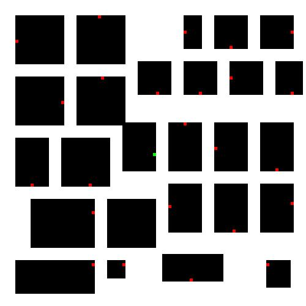
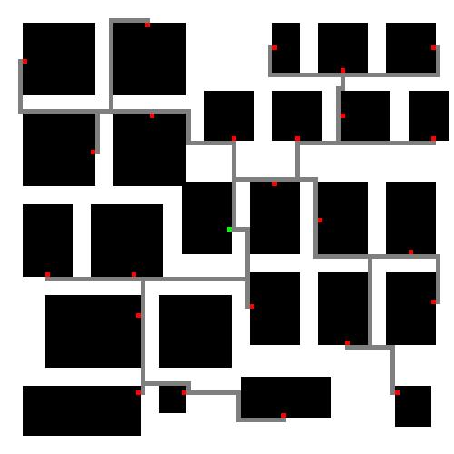

# Lee Maze Routing Algorithm

This project implements **Lee's Maze Routing Algorithm**, commonly used in **VLSI physical design** for routing connections between cells in CMOS chip layouts. The algorithm finds paths from a **source** to one or more **target** cells while avoiding **walls** (obstacles or modules).

---

## Use Case in VLSI Design

In chip design, it is essential to:
- Connect a central **source** (e.g., a power/clock net) to **multiple target cells** (logic blocks, memory, etc.)
- Avoid routing through occupied regions or **blocked modules** (walls)

This algorithm ensures:
- Minimum-length path
- Obstacle avoidance
- Compatibility with multiple targets (fan-out)
- Works on any grid size

> If a target is completely surrounded by walls, the algorithm will fail to connect, as expected in practical scenarios.

---

##  How It Works (In This Implementation)

This Python-based simulation:
1. **Takes an input image** containing colored pixels:
   - Green = Source
   - Red = Target
   - Black = Wall
2. **Converts the image into a matrix grid**
3. **Applies Lee's algorithm** to find shortest path(s) from the source to all targets
4. **Outputs the routed paths visually** in a new image

> The Input_matrix and Output_matrix image is used only for visualization use Test_matrix as input.

---

## Project Structure

## Features

- Supports **multiple targets**
- Automatically **avoids walls**
- Handles **any grid/image size**
- Visual, color-based input and output

---

## Libraries Used

- `Pillow` – for image handling
- `NumPy` – for matrix operations

---

## Sample Input & Output

| Input (test image) | Output (routed path) |
|--------------------|----------------------|
|  |  |

---

## Notes

- Input image must include:  
  - **1 green pixel** (source)  
  - **1+ red pixels** (targets)  
  - **Black regions** (walls)
- Ensure targets are not fully surrounded by walls
- This algorithm does not use heuristics; it's a **pure BFS-based shortest path search**

---

